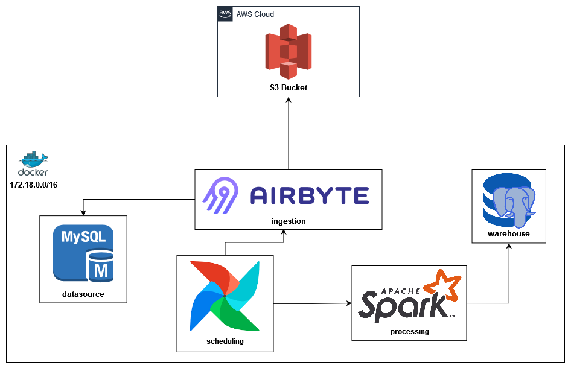

# Data Stack 
## _A simple data architecture using Airflow, Airbyte and Spark_
---
## Features

- Airflow as scheduler
- Airbyte as ingestion tool
- Spark as processing tool
- MySql as data source
- Postgres as data warehouse
---
## Architecture



---
## Installation

You need [Docker](https://www.docker.com/) to run the data stack.

To run the data stack you just need to:
```sh
docker compose --profile profilenameincmopose up -d
```
---
## Notes
You can read the full documentation about data stack on my [Medium Profile](https://medium.com/@isochoa95) 

